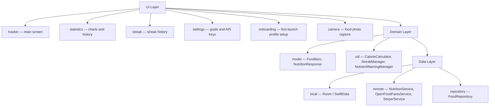
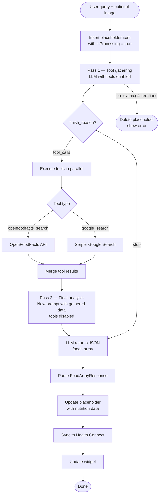

# Portio

AI-powered calorie and nutrition tracker for iOS and Android.

Log food by typing or taking a photo. The app uses an LLM with tool-calling to look up accurate nutritional data — searching OpenFoodFacts for branded products and Google Search for everything else.

## Features

- Log food via text or camera photo
- AI analysis (OpenRouter / Gemini) with parallel tool-calling
- Branded product lookup via OpenFoodFacts
- Nutrient search via Google Search (Serper)
- TDEE calculation using Mifflin-St Jeor formula
- AI-generated personalized calorie and macro goals
- Nutrition statistics and history
- Streaks — consecutive days with logged entries
- Nutrient imbalance and overshoot warnings
- Home screen widget
- iOS: HealthKit integration, Liquid Glass UI, deep links (`calcal://camera`, `calcal://add`)
- Android: Health Connect integration, Glance App Widget

## Setup

API keys are entered directly in the app on first launch (Settings screen). No config files needed.

Required keys:
- OpenRouter API key
- Serper API key
- Model name (e.g. `google/gemini-2.0-flash-001`)

## Tech Stack

### iOS
- Swift + SwiftUI
- SwiftData (local storage)
- WidgetKit + App Groups
- HealthKit

### Android
- Kotlin + Jetpack Compose
- Room + DataStore
- Hilt (DI), Retrofit + OkHttp
- CameraX, Health Connect
- Glance App Widgets

## Architecture

Both platforms follow MVVM + Repository pattern. The AI pipeline is identical: insert a placeholder item immediately for optimistic UI, fire the LLM request, update the record on completion.

## LLM Loop

Each food query goes through a two-pass agentic loop via OpenRouter.

## Requirements

- iOS 26+ (liquid glass UI)
- Android 8.0+ (API 26+) (Material 3 UI)
